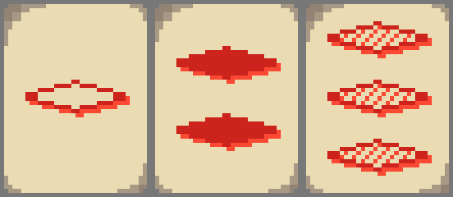

# SET game

SET game is a computer implementation of SET card game([Site](www.setgame.com)). It was created using C++ and [SDL2](https://www.libsdl.org/).

Compiled version for Linux is avilable in release v1.0. For other platform you have to compile it yourself.

## Rules

The playing board consist of 12 cards. Every card has four features:
1. Colour (Red, Green, Purple)
2. Shape (Rhombus, Oval, Squiggle)
3. Number of shapes (One, Two, Three)
4. Shading (solid, striped, open)

The goal of the game is to find a set of three card following conditions:
* For each feature (of the four possible):
	- all three cards have to display it as the same (for example three red cards)
	- no two cards can display the same feature - all three different types (for example red, green and purple cards)




Sometimes there can be no SETs on the table. When that happens you have to add 3 more cards, up to 21 card, because in 21 cards there has to be a set [OEIS](https://oeis.org/A090245).

## Gameplay

You can select cards by left-clicking. When three cards are selected the game will checks if it is a valid SET, and it will highlight it on green or red for half a second, if the set is right or wrong, accordingly.

You can add three cards by left-clicking outside the playing area (not on any card), and remove three card by right clicking.

## Compiling
### Linux
To run the game you have to install SDL2 and SDL2_image, which should be avilable in repositories of your distribution. to compile execute the following command in the project's root directory:
```
g++ -c src/*.cpp -std=c++14 -Wall -m64 -I include && mkdir -p bin/release && g++ *.o -O3 -o bin/release/main -s -lSDL2main -lSDL2 -lSDL2_image
```
The compiled file should be placed in ``./bin/release`` directory. You need to copy the ``./res`` directory there.
### Windows
After installing [Mingw64](https://sourceforge.net/projects/mingw-w64/files/Toolchains%20targetting%20Win64/Personal%20Builds/mingw-builds/8.1.0/threads-win32/seh/x86_64-8.1.0-release-win32-seh-rt_v6-rev0.7z/download), [SDL2](https://www.libsdl.org/download-2.0.php), [SDL_Image](https://www.libsdl.org/projects/SDL_image/), execute the following command in the project's root directory:
```
g++ -c src/*.cpp -std=c++14 -O3 -Wall -m64 -I include -I C:/SDL2-w64/include && g++ *.o -o bin/release/main -s -L C:/SDL2-w64/lib -lmingw32 -lSDL2main -lSDL2 -lSDL2_image
```
The compiled file should be placed in ``./bin/release`` directory. You need to copy the ``./res`` directory there to run the program.
